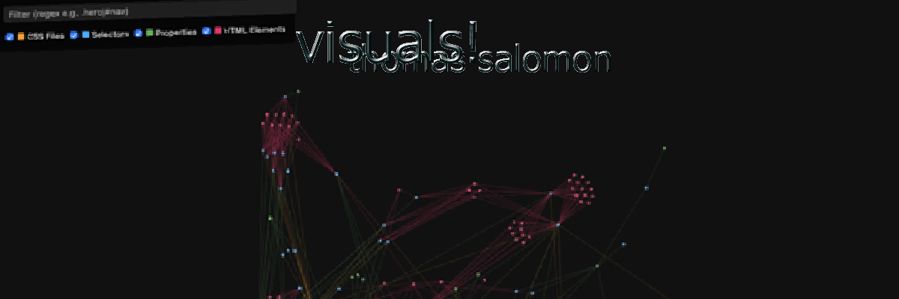
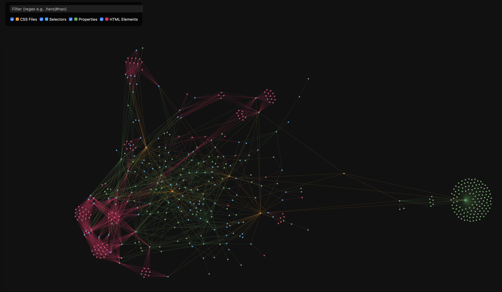

<h1 align="center">🎨 AI-WebAnalyzer</h1>
<p>

KI-Analyse, Visualisierung, Optimierung, Refaktorierung von CSS-Strukturen mit **Ollama**  </p>
<p align="center">
  
</p>

## 🚀 Funktionsübersicht

### 🧩 CSS-Graph der Struktur  

- Analysiert CSS-Dateien in definierter Reihenfolge  
- Baut logische Beziehungen auf (*Datei → Selektor → Property*)  
- Erstellt `css_graph_with_html.json` als Basis für Visualisierung  

### 🕸️ Interaktive Visualisierung  

  
- Zoom- und Pan-fähig (D3.js Force Graph)  
- Farbcodierung nach Typen: Datei 🟧, Selektor 🟦, Property 🟩, HTML 💖  
- Dynamische Legende mit Checkboxen zum Ein-/Ausblenden  
- Regex-Filter zum schnellen Finden von Selektoren oder Mustern  
- Tooltips mit Detailinformationen  

### 🌐 HTML-Zuordnung  
- Lädt HTML von einer URL oder lokalen Datei  
- Ermittelt, welche CSS-Selektoren im DOM tatsächlich vorkommen  
- Markiert unbenutzte Selektoren  

### 🤖 Optionale KI-Analyse (Ollama)  
- Refaktoriert CSS-Code semantisch  
- Prüft Struktur, Redundanzen und Naming-Konsistenz  
- Liefert textbasierte Berichte (Audit, Refactor, Insights)  

### 📊 Metriken & Insights  
- Erzeugt `css_summary.json` mit Property-Häufigkeiten  
- Erstellt `css_graph_analysis.md` mit semantischer Graph-Analyse  


## 🧱 Projektstruktur

```txt
AI-WebAnalyzer/
│
├── assets/
│   ├── css/style.css              → Globales Stylesheet für D3-Visualisierung
│   └── js/                        → Modularer D3-Code
│       ├── main.js                → Einstiegspunkt, lädt Graph und initiiert Render
│       ├── graph.js               → D3-Simulation, Nodes/Links, Force Layout
│       ├── filter.js              → Regex-Filterlogik
│       ├── legend.js              → Dynamische Legende mit Checkboxen
│       ├── tooltip.js             → Tooltip-Darstellung bei Hover
│       ├── zoom.js                → Zoom- und Pan-Logik (inkl. Reset)
│       └── color.js               → Farbdefinition nach Knotentyp
│
├── ollama/
│   ├── audit.py                   → CSS-Audit per Ollama-Modell
│   ├── graph_analysis.py          → Semantische Graph-Analyse (Verknüpfungen)
│   ├── refactor.py                → CSS-Refaktorierung
│   ├── insights.py                → Berechnung von Statistiken
│   ├── service.py                 → Start/Stop/Check des Ollama-Dienstes
│   └── utils.py                   → Hilfsfunktionen & Validierungen
│
├── output/                        → Generierte Ergebnisse
│   ├── css_graph_with_html.json   → Hauptgraph inkl. HTML-Nodes
│   ├── css_graph_analysis.md      → KI-Analyseergebnisse
│   └── refactored/                → Refaktorierte CSS-Dateien pro Input
│
├── templates/
│   └── css_graph.html             → HTML-Template für D3-Visualisierung
│
├── main.py                        → Zentrale Steuerung: Analyse, Graph, Serverstart
├── loader.py                      → Lädt & kombiniert CSS-Dateien
├── parser_css.py                  → Parsed CSS via cssutils & tinycss2
├── graph_builder.py               → Erstellt Beziehungsgraph
├── html_mapper.py                 → Verknüpft CSS-Selektoren mit HTML-Elementen
├── visualizer.py                  → Kopiert Template, startet lokalen Webserver
├── config.py                      → Liest Einstellungen aus `.env`
├── .env                           → Konfigurationsdatei
├── requirements.txt               → Python-Abhängigkeiten
└── readme.md                      → Diese Dokumentation